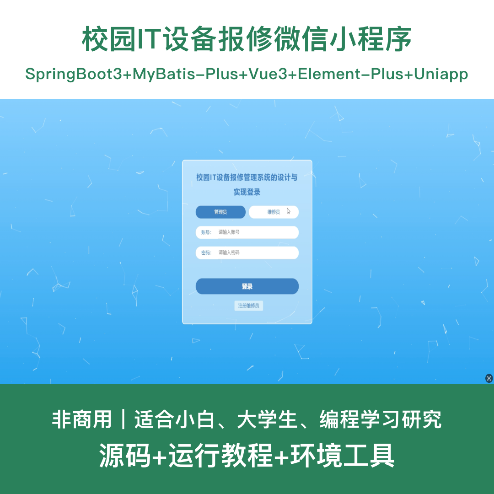
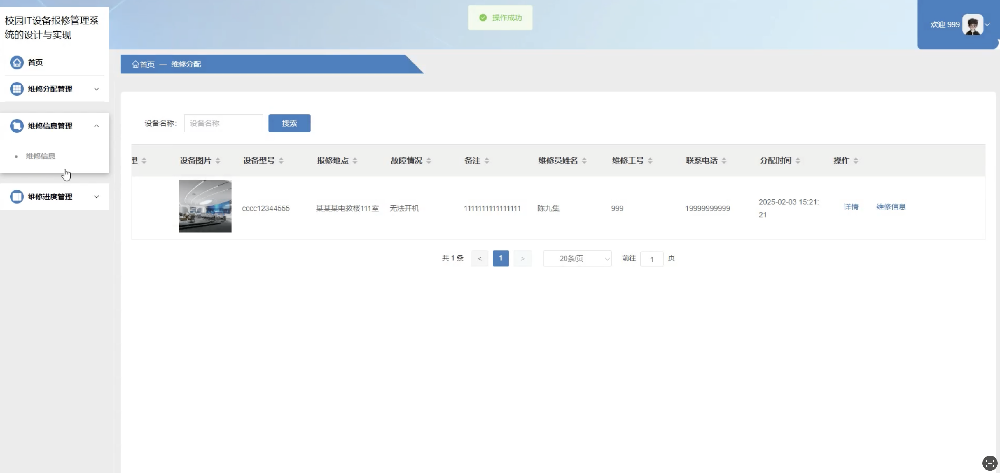
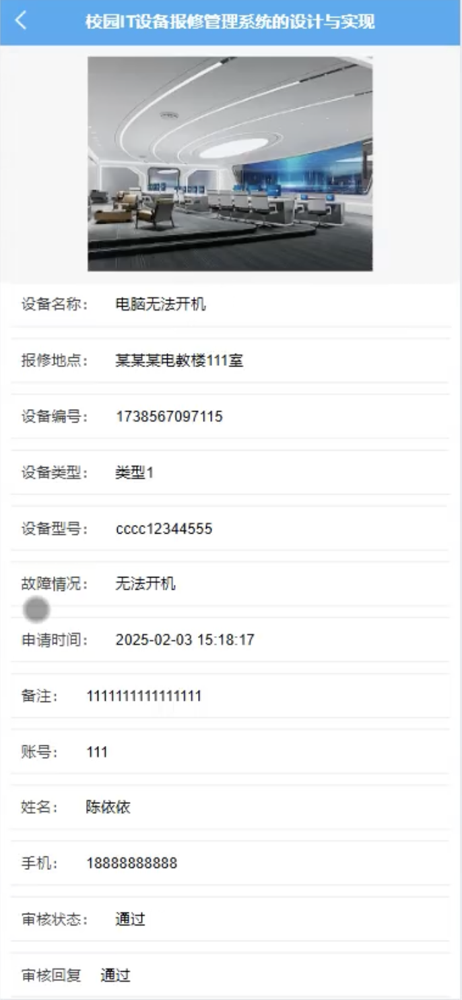

# mpweixinA239D
mpweixinA239D校园IT设备报修微信小程序
 
## 源码问题查看主页咨询

### 一、关键词
设备报修系统、IT报修系统、校园报修系统、设备维修系统、报修管理平台

### 二、作品包含
源码+数据库+全套环境和工具资源+本地部署教程

### 三、项目技术
前端技术：Html、Css、Js、Vue3.2、Element-Plus、uniapp
后端技术：Java、SpringBoot3.3.0、MyBatis-Plus

### 四、运行环境（以下版本亲测，其他版本兼容性请自行测试）
开发工具：IDEA/eclipse + VSCODE + HBuilder X + 微信开发者工具

数据库：MySQL 5.7+

数据库管理工具：Navicat10以上版本

环境配置软件：JDK17 + Maven3.6+

前端Nodejs：16+

浏览器：谷歌浏览器

### 五、项目介绍
项目编号：mpweixinA239D

基于uniapp的校园IT设备报修微信小程序，方便校园用户报修IT设备，维修员接单维修，管理员统一管理，提升校园设备维护效率。

角色：管理员、用户、维修员

用户功能：登录注册、设备报修、查看维修进度、维修记录、个人中心。

维修员功能：登录注册、查看维修分配、填写维修信息、更新维修进度、维修历史。

管理员功能：登录、用户管理、维修员管理、设备类型管理、设备报修管理、维修分配管理、维修信息管理、维修进度管理。

本系统包含11张数据库表。

### 六、运行截图

